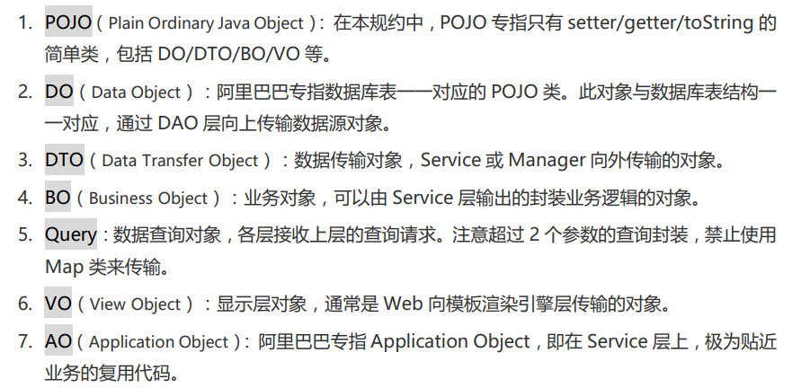
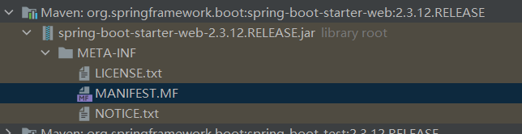
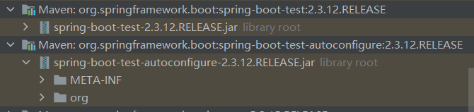

# 任务一

实现代码位置：demo

------------

##### 名词解释

截取自阿里巴巴的java开发手册



##### 增删改查

通过MyBatisPlus中提供的通用CRUD接口实现，如下

首先自定义Service接口继承IService接口，注意泛型

```java
public interface DoAlertService extends IService<DoAlert> {
}
```

然后定义实现类，实现上面定义的接口并继承IService接口的实现类ServiceImpl，注意泛型

```java
public class DoAlertServiceImpl extends ServiceImpl<DoAlertMapper, DoAlert> implements DoAlertService {
}
```

然后就可以在Controller中通过DoAlertServiceImpl的实例使用ServiceImpl中提供的通用CRUD方法。

##### 自定义功能

在mapper里面进行自定义功能，编写自定义功能的实现有两种方式

###### 通过xml

这种方式最好在IDE里面存放一个mapper.xml的模板

```xml
<?xml version="1.0" encoding="UTF-8" ?>
<!DOCTYPE mapper
        PUBLIC "-//mybatis.org//DTD Mapper 3.0//EN"
        "https://mybatis.org/dtd/mybatis-3-mapper.dtd">
<mapper namespace="">

</mapper>
```

namespace的值是xml文件对应的mapper

```java
List<AlertCountDTO> getAlertCountByMonth();
```

实现上面的功能只需要在对应的xml文件中添加下面的内容

```xml
<select id="getAlertCountByMonth" resultType="com.zhuweihao.demo.pojo.dto.AlertCountDTO">
    select date_format(create_time, '%Y-%m') createDate, count(*) as count from do_alert group by createDate
</select>
```

###### 通过注解

示例如下

```java
@Select("select * from do_alert WHERE date_format(create_time, '%Y-%m')=#{date} ORDER BY create_time DESC")
Page<DoAlert> getAlertByMonthPage(Page<DoAlert> page,String date);
```

---------

参考博客：https://blog.csdn.net/u013452337/article/details/100693418

------------

##### 分页功能

通过MybatisPlus提供的分页插件进行实现

```java
@Configuration
@MapperScan("com.zhuweihao.demo.mapper")
public class MybatisPlusConfig {

    @Bean
    public MybatisPlusInterceptor mybatisPlusInterceptor() {
        MybatisPlusInterceptor interceptor = new MybatisPlusInterceptor();
        interceptor.addInnerInterceptor(new PaginationInnerInterceptor(DbType.MYSQL));
        return interceptor;
    }
}
```

示例

```java
Page<DoAlert> getAlertByDayPage(Page<DoAlert> page,String date);
```

注意：

- 返回类型为Page
- 函数的第一个参数类型必须为Page

例如，下面的调用结果是返回结果集的第2页，每一页的大小为4

```java
Page<DoAlert> alertByDayPage = doAlertService.getBaseMapper().getAlertByDayPage(new Page<>(2, 4), date);
```

# 任务二

测试代码在demo下的HelloController

-----------

自定义SpringbootStarter

参考springboot官方提供的starter，以spring-boot-starter-web为例



这个依赖jar包里面没有任何class文件，通常一个starter场景启动器只是为了引入相关的依赖，还会有一个对应的autoconfigure自动配置包




**引入starter** **--- xxxAutoConfiguration --- 容器中放入组件 ---- 绑定xxxProperties ----** **配置项**